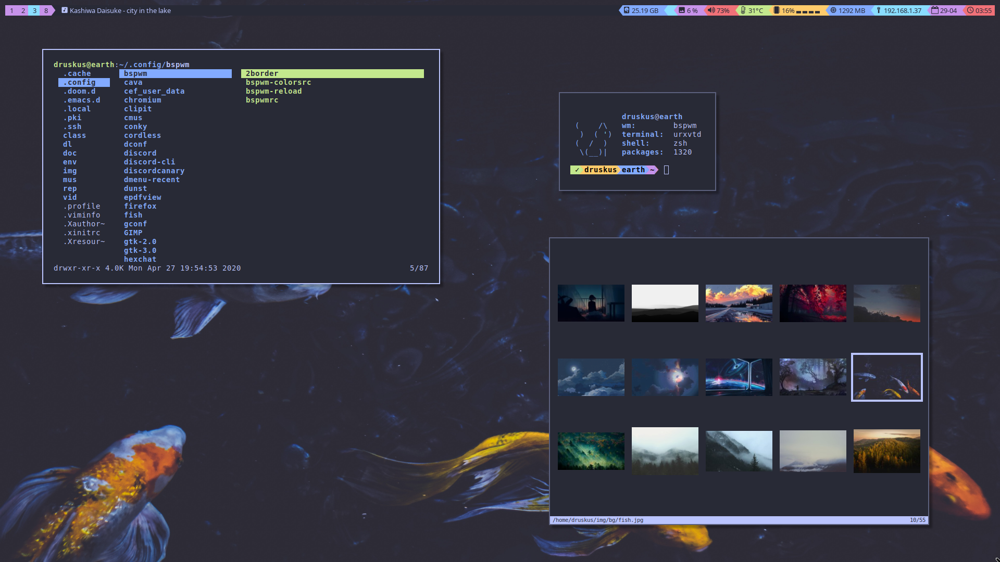
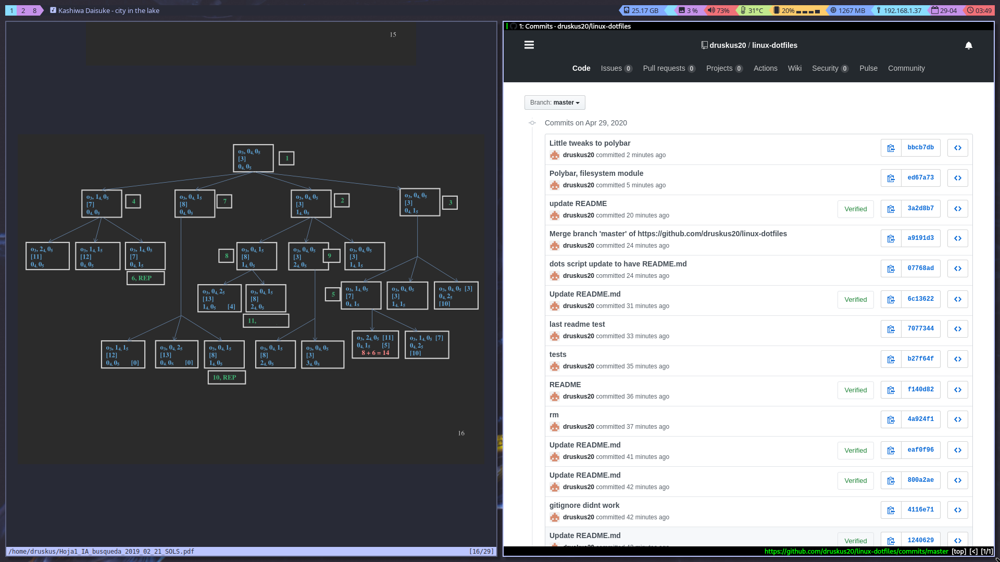

# dotfiles •••




### FAQ
#### What the fuck is a dotfile?
If you have ever used linux, you probably would have seen those hidden files that start with a ".". Well, thats why they are called dotfiles. Those files are sometimes configuration files.

#### Why do you store your dotfiles here?
I want to have a version control so I can always undo changes if something doesnt work. Also, its always useful to have any kind of backup, just in case.

#### How do you manage your dotfiles?
I use a git bare repository, you can see how looking at my .local/bin/dots script

#### How is it that you have a README.md file without it being on your home directory?

I figured out a workaround by running the following command: 
```git update-index --assume-unchanged "$HOME/README.md"```
That of course will not work if README.md is updated from the remote. Thats why I check if there is a README.md in my home folder and delete it. (see .local/bin/scripts/dots)


